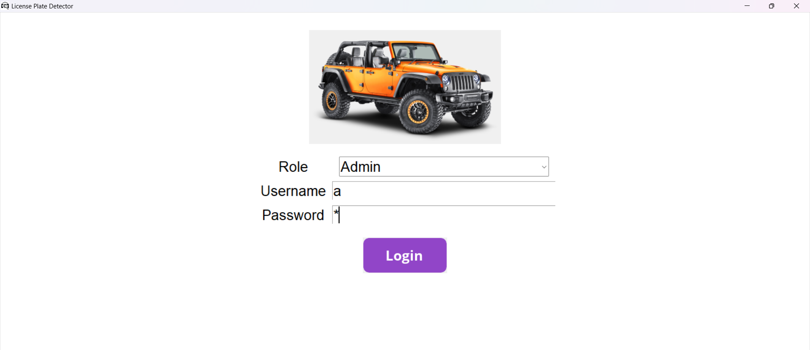
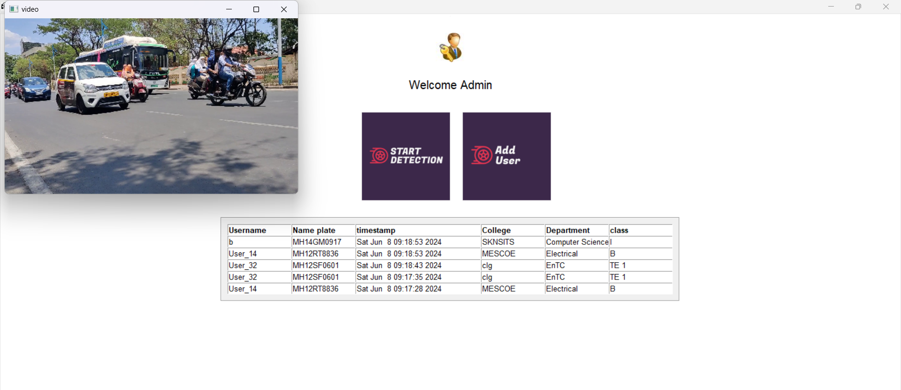

# Automatic Vehicle Number Plate Detection System

## Table of Contents
  - [Introduction](#introduction)
  - [Technologies Used](#technologies-used)
  - [System Architecture](#system-architecture)
  - [Images](#images)

## Introduction
This project is an Automatic Vehicle Number Plate Detection System that leverages Deep Learning (DL) techniques for real-time license plate recognition. The system captures video frames, detects and extracts license plate information, matches it with a database, and sends notifications via email.

## Technologies Used
- **Programming Language:** Python
- **GUI Framework:** Tkinter
- **Deep Learning Models:** YOLO, CNN
- **Database:** MySQL
- **Email Protocol:** SMTP

## System Architecture
1. **Surveillance Start:** Admin clicks 'Start Surveillance'.
2. **Video Capture:** Frames are captured in real-time from the video feed.
3. **YOLO Detection:** Frames are passed to the YOLO object detection model to find and draw bounding boxes around license plates.
4. **Image Processing:** 
   - The detected license plate region is cropped and converted to a grayscale image.
   - Contours are found and processed to isolate characters.
5. **Character Recognition:** 
   - The list of characters is passed to the CNN model.
   - CNN predicts each character and outputs a string.
6. **Database Matching:** The predicted string (license plate) is compared with the database.
7. **Information Retrieval:** Corresponding student information is fetched from the database.
8. **Notification:**
   - Display detected number plate and student information to the admin.
   - Send an email to the student with the vehicle number, image, and timestamp.
   - Announce the vehicle number via audio.

## Images

**Login Page :**

**Project Working :**

